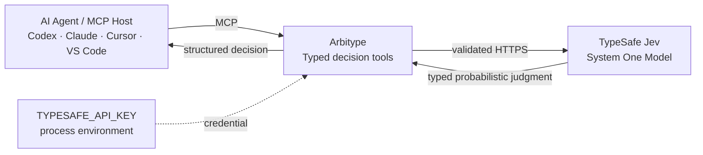

<div align="center">

# Arbitype

<p><strong>Typed decision tools for AI agents.</strong></p>

<p>Classify · Score · Verify · Gate · Route · Review</p>

<p><strong>MCP-native · Powered by TypeSafe Jev</strong></p>

<p>
  <a href="https://github.com/Renwang-Huang/arbitype/actions/workflows/ci.yml"></a>
  <a href="https://github.com/Renwang-Huang/arbitype/releases"></a>
  <a href="https://pypi.org/project/arbitype/"></a>
  <a href="https://github.com/Renwang-Huang/arbitype/blob/main/LICENSE"></a>
  
  <a href="https://github.com/modelcontextprotocol/modelcontextprotocol/tree/main/docs/specification/2026-07-28"></a>
</p>

<p>
  <a href="https://registry.modelcontextprotocol.io/?q=io.github.Renwang-Huang%2Farbitype"></a>
  <a href="https://glama.ai/mcp/servers/Renwang-Huang/arbitype"></a>
</p>

<p>
  <a href="#quick-start">Quick start</a> ·
  <a href="#why-arbitype">Why Arbitype?</a> ·
  <a href="#tools">Tools</a> ·
  <a href="#host-setup">Host setup</a> ·
  <a href="#configuration">Configuration</a> ·
  <a href="BENCHMARK.md">Engineering benchmark</a>
</p>

</div>

Arbitype is an MCP-native typed decision layer for AI agents, powered by
[TypeSafe Jev](https://typesafe.ai). It turns probabilistic judgments into
structured decision primitives that an agent or program can consume directly.

> [!NOTE]
> Arbitype is an independent open-source project. It is not an official
> TypeSafe AI product or an official integration for any particular agent host.

<!-- mcp-name: io.github.Renwang-Huang/arbitype -->

## Quick start

The shortest path is a local STDIO server launched by `uvx`:

```bash
export TYPESAFE_API_KEY="your-key"
uvx arbitype
```

The API key stays in the process environment. It is not an MCP argument and
is never printed to standard output.

Install a pinned release with:

```bash
uvx --from 'arbitype==0.6.0' arbitype
```

Or run the repository checkout:

```bash
git clone https://github.com/Renwang-Huang/arbitype.git
cd arbitype
export TYPESAFE_API_KEY="your-key"
python3 server.py
```

## Why Arbitype?

Generative models are excellent at prose, code, and open-ended generation.
Agent workflows also need bounded decisions that software can branch on:

```text
free-form state
      ↓
  TypeSafe Jev
      ↓
probabilistic judgment
      ↓
    Arbitype
      ↓
typed decision + probability
      ↓
agent / code branch
```

Arbitype provides that decision layer over MCP. It exposes short, host-neutral
primitives for classification, scoring, verification, routing, review, and
fail-closed gate signals. The result is structured data, not a paragraph that
an agent must interpret again.

## Architecture



The public product is Arbitype; TypeSafe Jev is the current provider. Provider
configuration intentionally keeps the `TYPESAFE_*` names because the
credential and endpoint belong to TypeSafe.

## Tools

Arbitype advertises nine read-only, idempotent MCP tools:

| Tool | Input shape | Output |
| --- | --- | --- |
| `evaluate` | `state` + TypeSafe `questions` map | Raw typed Jev response |
| `classify` | `state` + `instructions` + `labels` | Choice and probability distribution |
| `score` | `state` + `instructions` + ordered `levels` | Weighted score and distribution |
| `check` | `state` + yes/no criteria | Noul probability |
| `verify` | `state` + `claims` map | Noul answer per claim |
| `gate` | `state` + `checks` + thresholds | `pass`, `review`, or `fail` signal |
| `route` | `state` + `actions` map | One suggested next action; no execution |
| `review` | `state` + `checks` + thresholds | Review decision and evidence |
| `health` | Optional `live` boolean | Local configuration; live request only when explicit |

For raw Noul questions, provide non-empty `instructions` or at least one
non-empty `true`/`false` criterion. Score levels must be non-null structured
values. These provider-level constraints are validated locally before a paid
request.

Probabilities and confidence are model signals, not proof. `gate` and `review`
are advisory decision transformations, not authorization systems, security
boundaries, or approval engines.

## Host setup

Arbitype uses standard MCP STDIO. For a host that accepts an installed command:

```toml
[mcp_servers.arbitype]
command = "arbitype"
env_vars = ["TYPESAFE_API_KEY"]
startup_timeout_sec = 10
tool_timeout_sec = 60
default_tools_approval_mode = "prompt"
```

For a checkout:

```toml
[mcp_servers.arbitype]
command = "python3"
args = ["/absolute/path/to/arbitype/server.py"]
env_vars = ["TYPESAFE_API_KEY"]
startup_timeout_sec = 10
tool_timeout_sec = 60
```

The same process can be registered by Claude, Cursor, VS Code, Codex, or any
other MCP host using its native configuration format. Keep the key out of host
configuration files; use the host's environment forwarding mechanism.

## CLI and Python

The canonical CLI and package are `arbitype`:

```bash
arbitype --version
arbitype doctor --json
cat request.json | arbitype evaluate
arbitype evaluate --input request.json
```

The Python API is intentionally small:

```python
from arbitype import TypeSafeClient

client = TypeSafeClient()
result = client.evaluate({
    "state": "A payment failed twice.",
    "questions": {
        "urgent": {
            "type": "noul",
            "instructions": "Does this require urgent handling?",
        }
    },
})
```

### Compatibility names

The former public surfaces remain available as migration aliases and contain
no independent business logic:

| Surface | Status |
| --- | --- |
| `arbitype` | **Canonical package and CLI** |
| `typesafe_mcp` | Legacy Python compatibility shim |
| `typesafe_codex_mcp` | Legacy Python compatibility shim |
| `arbitype` | **Primary CLI** |
| `typesafe-mcp` | Legacy CLI alias |
| `typesafe-codex-mcp` | Legacy CLI alias |
| `route`, `review` | Current tool names |
| `codex_route`, `codex_review` | Legacy tool aliases |

The old `typesafe-mcp` PyPI project is not deleted or yanked. New
installations should use `arbitype`; existing installations can migrate when
convenient. Do not install both distributions into the same environment: the
Arbitype wheel provides the legacy module paths itself. Upgrade with
`python -m pip uninstall typesafe-mcp` followed by `python -m pip install arbitype`
when moving an environment to the new package.

## Discovery and Registry

The canonical MCP Registry identity is:

```text
io.github.Renwang-Huang/arbitype
```

The intended package entry is:

```text
uvx arbitype
```

The former identity `io.github.Renwang-Huang/typesafe-mcp` is a legacy
identity. It must remain available for existing users and should be marked
deprecated through the Registry publisher when that mutation is supported.
New installations should use the Arbitype identity.

## Configuration

| Variable | Default | Purpose |
| --- | --- | --- |
| `TYPESAFE_API_KEY` | — | Required TypeSafe bearer credential |
| `TYPESAFE_BASE_URL` | `https://api.typesafe.ai` | API base URL |
| `TYPESAFE_MODEL` | `jev-latest` | Model alias; legacy name supported |
| `TYPESAFE_DEFAULT_MODEL` | `jev-latest` | Official SDK-compatible model name |
| `TYPESAFE_TIMEOUT_SECONDS` | `10` | Per HTTP attempt timeout |
| `TYPESAFE_MAX_RETRIES` | `2` | Retries after the initial request |
| `TYPESAFE_RETRY_BACKOFF_SECONDS` | `0.5` | Initial exponential backoff |
| `TYPESAFE_MAX_STATE_CHARS` | `120000` | Serialized state limit |
| `TYPESAFE_MAX_QUESTION_CHARS` | `60000` | Serialized question limit |
| `TYPESAFE_MAX_REQUEST_BYTES` | `512000` | Whole request limit |
| `TYPESAFE_MAX_RESPONSE_BYTES` | `4194304` | Provider response limit |

Custom provider endpoints must use HTTPS. Plain HTTP is accepted only for
loopback hosts such as `localhost`, `127.0.0.1`, and `::1`. Redirects are
disabled so a bearer credential is never forwarded to a redirect target.

## Security boundaries

Arbitype is a local MCP adapter and typed decision layer. It is not:

- a sandbox for untrusted code;
- an authorization or identity system;
- a prompt-injection firewall;
- a security approval boundary; or
- an official TypeSafe AI product.

It does not execute actions suggested by `route`, edit files, run shell
commands, or treat model probabilities as proof. Read [SECURITY.md](SECURITY.md)
before using live credentials.

## Development

```bash
python3 -m unittest discover -s tests -v
python3 -m compileall -q .
python3 -m pip wheel --no-deps . --wheel-dir /tmp/arbitype-dist
```

The test suite uses local fakes and does not need an API key. The official MCP
Python SDK interoperability smoke test is in
[`scripts/official_sdk_smoke.py`](scripts/official_sdk_smoke.py). A live Jev
check is opt-in and paid:

```bash
TYPESAFE_API_KEY="your-key" arbitype doctor --live
```

See [TESTING.md](TESTING.md), [CONTRIBUTING.md](CONTRIBUTING.md), and
[BENCHMARK.md](BENCHMARK.md) for the full engineering checks and comparison.
Maintainer migration details are in
[`docs/REGISTRY_MIGRATION.md`](docs/REGISTRY_MIGRATION.md).

## Release identity

Arbitype is currently released as `0.6.0` because it remains Beta while its
canonical public identity moves to the new package, CLI, and Registry name.
The old package history remains intact; the brand migration does not rewrite
Git history or delete the former PyPI project.
