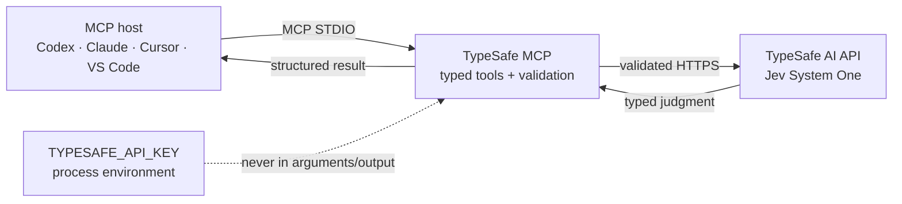

<div align="center">

<h1>TypeSafe MCP</h1>

<p><strong>A host-neutral, dependency-free MCP bridge for TypeSafe AI's Jev judgments.</strong></p>

<p>
  <a href="https://github.com/Renwang-Huang/typesafe-mcp/actions/workflows/ci.yml"></a>
  <a href="https://github.com/Renwang-Huang/typesafe-mcp/releases"></a>
  <a href="https://pypi.org/project/typesafe-mcp/"></a>
  <a href="https://github.com/Renwang-Huang/typesafe-mcp/blob/main/LICENSE"></a>
  
  <a href="https://github.com/modelcontextprotocol/modelcontextprotocol/tree/main/docs/specification/2026-07-28"></a>
</p>

<p>
  <a href="#quick-start">Quick start</a> ·
  <a href="#host-setup">Host setup</a> ·
  <a href="#tools">Tools</a> ·
  <a href="#configuration">Configuration</a> ·
  <a href="BENCHMARK.md">Engineering benchmark</a>
</p>

</div>

TypeSafe MCP adapts the [TypeSafe AI](https://typesafe.ai) Jev System One API
to standard MCP STDIO. It keeps credentials in the process environment,
validates requests and responses, retries temporary provider failures safely,
and returns typed results to MCP-capable hosts.

> [!NOTE]
> TypeSafe MCP is an independent community project. It is not an official
> TypeSafe AI product or an official integration for any particular agent host.

<!-- mcp-name: io.github.Renwang-Huang/typesafe-mcp -->

## At a glance

| | |
| --- | --- |
| **Runtime** | Python 3.10+ · standard library at runtime · no third-party runtime dependencies |
| **Transport** | Newline-delimited MCP STDIO |
| **Protocol** | MCP `2026-07-28` metadata path plus legacy `initialize` revisions |
| **Provider** | TypeSafe AI Jev System One over HTTPS |
| **Surface** | 9 read-only, idempotent tools with structured output schemas |
| **Security posture** | Environment-only credential · bounded payloads · redacted diagnostics |

## How it fits



## What you get

| Capability | Result |
| --- | --- |
| **Typed judgments** | `evaluate` stays close to the raw `noul`, `choice`, and `score` API. |
| **Convenience tools** | `classify`, `score`, `check`, and `verify` remove repetitive question-map boilerplate. |
| **Bounded decisions** | `gate` and `review` return `pass`, `review`, or `fail` signals without authorizing actions. |
| **Agent routing** | `route` selects one next action from a closed set; it never executes it. |
| **Operational safety** | Strict response validation, bounded retries, `Retry-After`, size limits, and credential redaction. |
| **Host portability** | One STDIO process works with Codex, Claude, Cursor, VS Code, and other MCP hosts. |

Probabilities and confidence are model signals, not proof. `verify` and `gate`
are deliberately not security boundaries or authorization systems.

## Quick start

### Run from a checkout

```bash
git clone https://github.com/Renwang-Huang/typesafe-mcp.git
cd typesafe-mcp
export TYPESAFE_API_KEY="your-key"
python3 server.py
```

### Install as a command

```bash
python3 -m pip install .
typesafe-mcp --version
typesafe-mcp doctor --json
```

The package has no runtime dependencies. Once [`uv`](https://docs.astral.sh/uv/)
is installed, run the published PyPI package directly:

```bash
uvx typesafe-mcp
```

To pin the published version:

```bash
uvx --from 'typesafe-mcp==0.5.2' typesafe-mcp
```

For an unreleased source checkout, `uvx` can also run a pinned Git tag:

```bash
uvx --from 'git+https://github.com/Renwang-Huang/typesafe-mcp@v0.5.2' \
  typesafe-mcp
```

### Package layout and compatibility

| Entry | Status | Use |
| --- | --- | --- |
| `typesafe_mcp` | **Canonical** | Import this package and add new implementation code here. |
| `typesafe_codex_mcp` | Legacy shim | Re-exports the canonical package for existing imports; it is not a second server. |
| `typesafe-mcp` | **Primary CLI** | Use for new installations. |
| `typesafe-codex-mcp` | Migration alias | Retained for existing host configurations. |
| `route`, `review` | **Current tools** | Use these names in new MCP configurations. |
| `codex_route`, `codex_review` | Legacy tool aliases | Accepted for callers that have not migrated. |

The legacy package and aliases contain no independent business logic and must
not receive new implementation code.

## Host setup

The service uses the standard MCP STDIO transport. Every host has its own
configuration syntax, but the process and environment contract are the same.
For example, a checkout can be registered in a Codex `config.toml` like this:

```toml
[mcp_servers.typesafe]
command = "python3"
args = ["/absolute/path/to/typesafe-mcp/server.py"]
env_vars = ["TYPESAFE_API_KEY"]
startup_timeout_sec = 10
tool_timeout_sec = 60
default_tools_approval_mode = "prompt"
enabled_tools = [
  "route", "review", "classify", "score", "check", "verify", "gate",
  "evaluate", "health"
]
```

For an installed command:

```toml
[mcp_servers.typesafe]
command = "typesafe-mcp"
env_vars = ["TYPESAFE_API_KEY"]
startup_timeout_sec = 10
tool_timeout_sec = 60
default_tools_approval_mode = "prompt"
```

Keep the key out of host configuration files; `env_vars` asks the host to
forward the environment variable without putting its value in the command
line. The same STDIO process can be registered by Claude, Cursor, VS Code, or
another MCP host using that host's native configuration format.

The old `typesafe-codex-mcp` command and `typesafe_codex_mcp` Python import are
kept as migration aliases. Calls to `codex_route` and `codex_review` are also
accepted, but new configurations should use `route` and `review`.

## Tools

| Tool | Input shape | Output |
| --- | --- | --- |
| `evaluate` | `state` + TypeSafe `questions` map | Raw TypeSafe response |
| `classify` | `state` + `instructions` + `labels` | One Choice answer and distribution |
| `score` | `state` + `instructions` + ordered `levels` | One Score answer and distribution |
| `check` | `state` + yes/no `instructions` | One Noul probability |
| `verify` | `state` + `claims` map | One Noul answer per claim |
| `gate` | `state` + `checks` map + thresholds | `pass`, `review`, or `fail` plus evidence |
| `route` | `state` + `actions` map | Suggested next action; no execution |
| `review` | `state` + `checks` map + thresholds | Review decision and evidence |
| `health` | Optional `live` boolean | Local configuration; live request only when explicit |

Example `classify` call:

```json
{
  "state": "The payment was charged twice.",
  "instructions": "Which team should own this ticket?",
  "labels": {
    "billing": "Payments, invoices, refunds, or duplicate charges",
    "technical": "Bugs, outages, or integration failures",
    "other": "Anything that does not fit the first two labels"
  }
}
```

## CLI and library mode

The MCP process is the default command. The same package can be used in CI:

```bash
typesafe-mcp doctor --json
cat request.json | typesafe-mcp evaluate
typesafe-mcp evaluate --input request.json
```

The Python library is intentionally small:

```python
from typesafe_mcp import TypeSafeClient

client = TypeSafeClient()
result = client.evaluate({
    "state": "A payment failed twice.",
    "questions": {
        "urgent": {
            "type": "noul",
            "instructions": "Does this require urgent handling?",
        }
    },
})
```

## Configuration

| Variable | Default | Purpose |
| --- | --- | --- |
| `TYPESAFE_API_KEY` | — | Required bearer credential |
| `TYPESAFE_BASE_URL` | `https://api.typesafe.ai` | API base URL |
| `TYPESAFE_MODEL` | `jev-latest` | Model alias; legacy name supported |
| `TYPESAFE_DEFAULT_MODEL` | `jev-latest` | Official SDK-compatible model name |
| `TYPESAFE_TIMEOUT_SECONDS` | `10` | Per HTTP attempt timeout |
| `TYPESAFE_MAX_RETRIES` | `2` | Retries after the initial request |
| `TYPESAFE_RETRY_BACKOFF_SECONDS` | `0.5` | Initial exponential backoff |
| `TYPESAFE_MAX_STATE_CHARS` | `120000` | Serialized state limit |
| `TYPESAFE_MAX_QUESTION_CHARS` | `60000` | Serialized question limit |
| `TYPESAFE_MAX_REQUEST_BYTES` | `512000` | Whole request limit |
| `TYPESAFE_MAX_RESPONSE_BYTES` | `4194304` | Provider response limit |

## Development

```bash
python3 -m unittest discover -s tests -v
python3 -m compileall -q .
python3 -m pip wheel --no-deps . --wheel-dir /tmp/typesafe-mcp-dist
```

The test suite uses local fakes only; it never needs an API key. A live check
is opt-in and makes one paid request:

```bash
TYPESAFE_API_KEY="your-key" typesafe-mcp doctor --live
```

See [SECURITY.md](SECURITY.md) before using live credentials and
[BENCHMARK.md](BENCHMARK.md) for the comparison against the community
implementations reviewed during development.

## Boundaries

| Supported in v0.5.2 | Deliberately not provided |
| --- | --- |
| MCP STDIO, modern `2026-07-28` metadata, and earlier `initialize` revisions | Streamable HTTP, SSE, or OAuth |
| Tools with typed inputs, structured outputs, and read-only annotations | Resources, prompts, subscriptions, or elicitation |
| Bounded TypeSafe judgments and deterministic local gate transformations | File edits, shell commands, authorization, or security approval |

Jev is designed for bounded judgments. Use ordinary code for exact math, date
arithmetic, and authorization; use a generative model for prose or code
generation. The bridge sends `state` to TypeSafe, so do not pass secrets or
personal data without checking your data-handling requirements.
